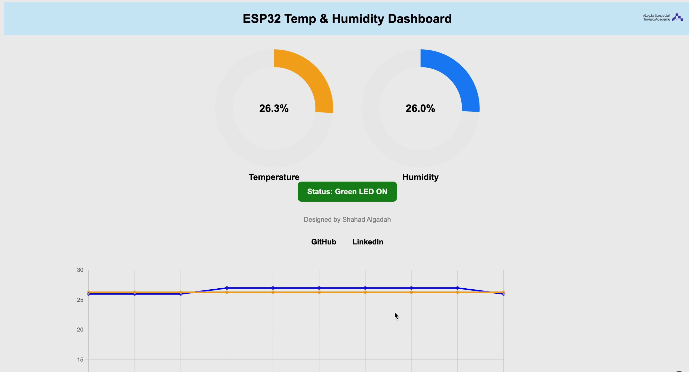
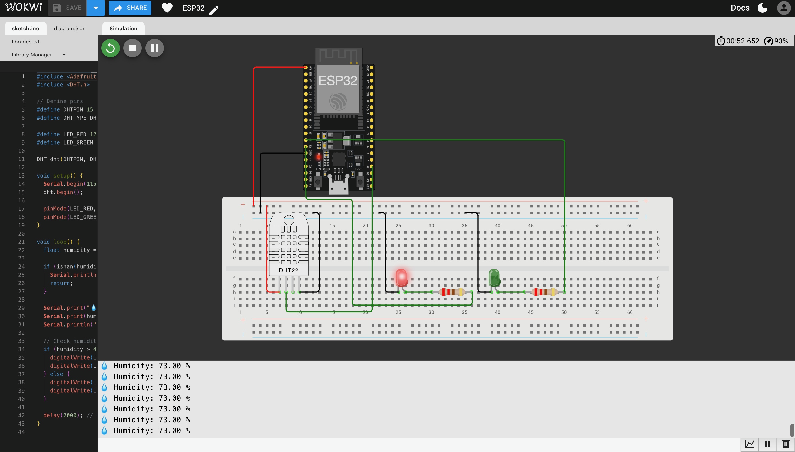

# ESP32 Temperature & Humidity Dashboard 🌡️💧

> Real-time IoT dashboard using ESP32 and DHT11 sensor to monitor temperature and humidity, with live charts and LED indicators.  
> Built during the **ESP32 Training Program at [Tuwaiq Academy](https://www.linkedin.com/company/tuwaiqacademy/)**.

---

## 🔍 Overview

This project showcases a real-time IoT dashboard using the ESP32 microcontroller. It:

- Reads data from a **DHT11** temperature and humidity sensor  
- Hosts a **local web server** to display live sensor data  
- Visualizes readings with **dynamic charts** powered by Chart.js  
- Uses **LED indicators** to reflect environmental conditions

---

## 🛠️ Technologies Used

- ESP32 Dev Board  
- DHT11 Sensor  
- WiFi (built-in)  
- HTML/CSS & JavaScript (Chart.js)  
- Arduino IDE  

---

## 🎯 Features

- 📊 Real-time temperature & humidity monitoring  
- 📈 Donut & line charts that auto-update every 2 seconds  
- 🚦 LED status logic based on humidity thresholds  
- 🌐 Responsive and interactive web interface  

---

## 🖼️ Project Preview

### 📸 Hardware Setup

### 💻 Web Dashboard

### 🔌 Circuit Diagram

---

## 🚦 LED Status Logic

- 🔴 Red LED blinks when **humidity > 40%**  
- 🟢 Green LED stays ON when **humidity ≤ 40%**

---

## 👩🏻‍💻 Developed By

**Shahad Algadah**

---

## 🔗 Connect With Me

- [GitHub](https://github.com/qshahad)  
- [LinkedIn](https://www.linkedin.com/in/shahad-algadah-841509337)

---

## 🎓 Built As Part of

**[Tuwaiq Academy](https://www.linkedin.com/company/tuwaiqacademy/)** – *ESP32 Training Program*

> This project was my first step into the world of **embedded systems** and **IoT**. It combined my passion for hardware and real-time software, transforming theoretical knowledge into a practical application.  
>  
> Special thanks to Tuwaiq Academy for the guidance and opportunity 🙏

